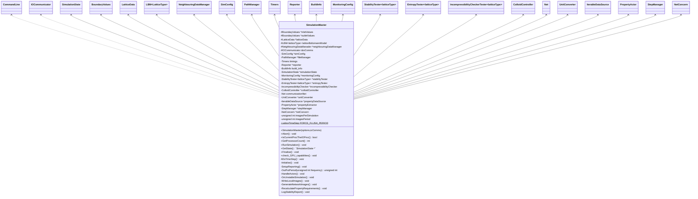
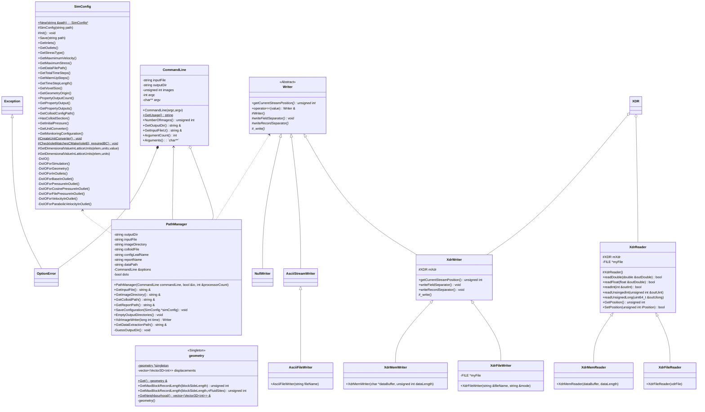
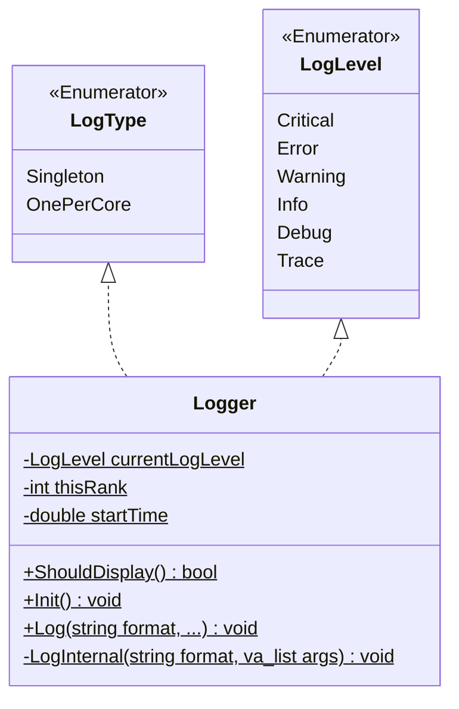
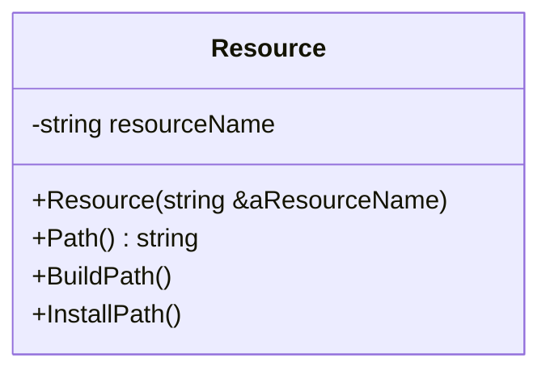

# HemePure-diagrams
Mermaid Diagrams for HemePure

## SimulationMaster 

```mermaid


classDiagram
direction BT

%% --- src/SimulationMaster.h

class SimulationMaster {
    +SimulationMaster(options,ioComms)
    +Abort() void
    +IsCurrentProcTheIOProc() bool
    +GetProcessorCount() int
    +RunSimulation() void
    +GetState() `SimulationState *`
    +Finalise() void
    +check_GPU_capabilities() void
    #DoTimeStep()* void

    -Initialise() void
    -SetupReporting() void
    -OutPutPeriod(unsigned int frequency) unsigned int
    -HandleActors() void
    -OnUnstableSimulation() void
    -WriteLocalImages() void
    -GenerateNetworkImages() void
    -RecalculatePropertyRequirements() void
    -LogStabilityReport() void

    #BoundaryValues *inletValues
    #BoundaryValues *outletValues
    #LatticeData *latticeData
    #LBM~latticeType~ latticeBoltzmannModel
    #NeighbouringDataManader *neighbouringDataManager
    #IOCommunicator &ioComms

    -SimConfig *simConfig
    -PathManager *fileManager
    -Timers timings
    -Reporter *reporter
    -BuildInfo build_info

    -SimulationState *simulationState
    -MonitoringConfig *monitoringConfig
    -StabilityTester~latticeType~ *stabilityTester
    -EntropyTester~latticeType~ *entropyTester

    -IncompressibilityChecker *incompressibilityChecker
    -ColloidController *colloidController
    -Net communicationNet

    -UnitConverter *unitConverter
    -IterableDataSource *propertyDataSource
    -PropertyActor *propertyExtractor

    -StepManager *stepManager
    -NetConcern *netConcern 

    -unsigned int imagesPerSimulation
    -unsigned int imagesPeriod
    -LatticeTimeStep FORCE_FLUSH_PERIOD$
}

SimulationMaster ..> CommandLine
SimulationMaster ..> IOCommunicator

SimulationMaster --> SimulationState
SimulationMaster --> BoundaryValues

SimulationMaster --> LatticeData

SimulationMaster --> LBM~LatticeType~
SimulationMaster --> NeighbouringDataManager

SimulationMaster --> SimConfig
SimulationMaster --> PathManager
SimulationMaster --> Timers
SimulationMaster --> Reporter
SimulationMaster --> BuildInfo

SimulationMaster --> MonitoringConfig
SimulationMaster --> StabilityTester~latticeType~
SimulationMaster --> EntropyTester~latticeType~
SimulationMaster --> IncompressibilityCheckerTester~latticeType~

SimulationMaster --> ColloidController
SimulationMaster --> Net

SimulationMaster --> UnitConverter

SimulationMaster --> IterableDataSource
SimulationMaster --> PropertyActor

SimulationMaster --> StepManager
SimulationMaster --> NetConcern
```

## Net

```mermaid
---
title: HemeLB Structure
---
classDiagram
direction BT

%% --- src/net/phased/Concern.h

class Concern {
    <<Abstract>>
    +CallAction(int action)* : bool
}

%% --- src/net/phased/NetConcern.h

class NetConcern {
    +NetConcern(BaseNet &net)
    +CallAction(int action) : bool
    -BaseNet &net;
}

NetConcern --|> Concern
NetConcern --> BaseNet

%% --- src/net/phased/StepManager.h

class StepManager {
    +StepManager(Phase phases, Timers *timers, bool separate_concerns)
    +Register(Phase phase, Step step, Concern &concern, MethodLabel method) : void
    +RegisterIteratedActorSteps(Concern &concern, Phase phase): void
    +RegisterCommsSteps(Concern &concern, Phase phase): void
    +RegisterCommsForAllPhases(Concern &concern): void
    +CallActionsForPhaseSeparatedConcerns(Phase phase): void
    +CallActionsForPhase(Phase phase): void
    +CallActionsForStepForConcern(Step step,Concern *concern, Phase phase): void
    +CallActionsForStep(Step step, Phase phase): void
    +CallActions() : void
    +CallActionsSeparatedConcerns() : void
    +CallSpecialAction(Step step) : void
    +ConcernCount() : unsigned int
    +ActionCount() : unsigned int

    -vector~Registry~ registry
    -vector~Concern*~ concerns
    -Timers *timers
    -StartTimer(step) : void
    -StopTimer(step) : void
    -bool separate_concerns;
}

StepManager --> Timers
StepManager ..> Step

class Registry {
        <<Map>>
}

Registry --* StepManager

Registry ..> Step
Registry ..> Action 
StepManager ..> Concern

Action --* StepManager

class Action {
    +Concern *concern
    +MethodLabel method
    +string name
    +Action(Concern &concern, MethodLabel method)
    +Action(Action &action)
    +Call() : bool
}

Action ..> Concern

%% --- src/net/phased/steps.h

class Step {
    <<Enumeration>>
    BeginAll = -1
    BeginPhase = 0
    Receive = 1
    PreSend = 2
    PreWait = 3
    Send = 4
    Wait = 5
    EndPhase = 6
    EndAll = 7    
}

%% ----

class BaseNet {
    +BaseNet(MpiCommunicator &communicator)
    +Receive()
    +Send()
    +Wait()*
    +Dispatch()
    +Rank() : int
    +Size() : int

    +GetCommunicator() : MpiCommunicator &
    +GetDisplacementsBuffer() : vector~int~
    +GetCountsBuffer() : vector~int~
    
    %% members
    +MpiCommunicator &communicator
    -vector~vector~int~~ displacementsBuffer
    -vector~vector~int~~ countsBuffer
}

BaseNet ..> MpiCommunicator

%%--- src/net/MpiGroup.h  ---

class MpiGroup {
    +MpiGroup()
    +Rank() : int
    +Size() : int
    +Exclude(vector~proc_t~ &ranksToExclude) : MpiGroup
    +Include(vector~proc_t~ &ranksToInclude) : MpiGroup
    -MpiGroup(MPI_Group grp,bool own)
    -shared_ptr~MPI_Group~ groupPtr;
}

MpiGroup .. MpiCommunicator : friend

%%--- src/net/MpiFile.h  ---

class MpiFile {
    +MpiFile()
    +Open(MpiCommunicator &comm, string &filename, int mode, MPI_Info info)
    +Close() void
    +SetView(disp,etype,filetype,datarep,info)
    +GetCommunicator() MpiCommunicator &
    +Read(...) void
    +ReadAt(...) void
    +Write(...) void
    +WriteAt(...) void
    +WriteAt_nonBlocking(...) void
    #MpiFile(MpiCommunicator &parentComm, MPI_File fh)
    #MpiCommunicator *comm
    #shared_ptr~MPI_File~filePtr
}

MpiFile --> MpiCommunicator

%%--- src/net/MpiCommunicator.h  ---

class MpiCommunicator {
    +World() MpiCommunicator$
    +MpiCommunicator()
    +Rank() int*
    +Size() int*
    +Create(MpiGroup &grp) MpiCommunicator
    +Group() MpiGroup
    +Abort(int errCode) void
    +Duplicate() MpiCommunicator

    %% templated methods
    +Broadcast(...) void
    +AllReduce(...) void
    +Reduce(...) void
    +Gather(...) void
    +AllGather(...) void
    +AllNeighGather(...) void
    +AllNeighGatherV(...) void
    +AlltoAll(...) void
    +Send(...) void
    +Receive(...) void
    +Graph(...) : MpiCommunicator
    +GetNeighbors() vector~int~

    +GetNeighborsCounts() : int
    +Barrier() : void
    #MpiCommunicator(MPI_Comm communicator, bool willOwn)
    #shared_ptr~MPI_Comm~ commPtr
}

MpiCommunicator ..> MpiGroup

%%--- src/net/IOCommunicator.h

class IOCommunicator {
    +IOCommunicator(MpiCommunicator &comm)
    +OnIORank() : bool
    +GetIORank() : int
}

IOCommunicator --|> MpiCommunicator

%%--- src/net/MpiEnvironment.h

class MpiEnvironment {
    +MpiEnvironment(argc,argv)
    +Initialized() : bool$
    +Finalized() : bool$
    +Abort(int errorCode) : void$
    -bool doesOwnMpi
}

%% --- src/net/MpiDataType.h

class MpiDataTypeTraits {
    +GetMpiDataType() MPI_Datatype$
    -MPI_Datatype mpiType$
    -RegisterMpiDataType()$ MPI_Datatype
}

%% --- src/net/IteratedAction.h

class IteratedAction {
    <<Interface>>
    +CallAction(int action) bool
    +RequestComms()* void
    +PreSend()* void
    +PreReceive()* void
    +PostReceive()* void
    +EndIteration()* void
}

IteratedAction --|> Concern

%%--- src/net/StoredRequest.h ---

class SimpleRequest {
    +void *Pointer
    +int Count
    +MPI_Datatype Type
    +proc_t Rank
    +SimpleRequest(void *pointer, int count, MPI_Datatype type, proc_t rank)
}

class ScalarRequest {
    +ScalarRequest(void * pointer, MPI_Datatype type, proc_t rank)
}

ScalarRequest --|> SimpleRequest

class GatherVRecieveRequest {
    +int *Counts
    +int *Displacements
    +GatherVRecieveRequest(void *pointer, int *displacements, int *counts, MPI_Datatype type)
}

GatherVRecieveRequest --|> SimpleRequest


%%--- src/net/ProcComms.h ---

class BaseProcComms~Request~ {
    +MPI_Datatype Type
}

BaseProcComms --|> deque~Request~

class ProcComms {
    +CreateMPIType() : void
}

class GatherProcComms
class AllToAllProcComms
class GatherVReceiveProcComms

ProcComms --|> BaseProcComms
ProcComms ..> SimpleRequest

GatherProcComms --|> BaseProcComms
GatherProcComms ..> ScalarRequest

AllToAllProcComms --|> BaseProcComms
AllToAllProcComms ..> SimpleRequest

GatherVReceiveProcComms --|> BaseProcComms
GatherVReceiveProcComms ..> GatherVRecieveRequest

%% --- src/net/net.h

class Net {
    +Net(MpiCommunicator &communicator)
}
Net ..> MpiCommunicator

Net --|> PointPointImpl
Net --|> InterfaceDelegationNet
Net --|> AllToAllImpl
Net --|> GathersImpl

%% --- src/net/mixins/StoringNet.h

class StoringNet {
  +StoringNet(MpiCommunicator &comms)
}
StoringNet ..> MpiCommunicator
StoringNet --|> BaseNet

%% --- src/net/mixins/InterfaceDelegationNet.h

class InterfaceDelegationNet {
  +InterfaceDelegation(MpiCommunicator &comms)
  +RequestSendV()
  +RequestSendR()
  +RequestReceiveR()
  +RequestReceiveV()
  +RequestGatherVReceive()
  +RequestGatherReceive()
  +RequestGatherSend()
  +RequestGatherVSend()
  +RequestAllToAllSend()
  +RequestAllToAllReceive()

  %% ...
}
InterfaceDelegationNet ..> MpiCommunicator
InterfaceDelegationNet --|> BaseNet

%% --- src/net/mixins/pointpoint/CoalescePointPoint.h

class CoalescePointPoint {
  +CoalescePointPoint(MpiCommunicator &comms)
  +WaitPointToPoint() : void
  #ReceivePointToPoint() : void
  #SendPointToPoint() : void
  -EnsureEnoughRequests(size_t count) void
  -EnsurePreparedToSendReceive()
  -bool sendReceivePrepped
  -vector~MPI_Request~ requests
  -vector~MPI_Status~ statuses
}
CoalescePointPoint ..> MpiCommunicator
CoalescePointPoint --|> StoringNet

%% --- src/net/mixins/pointpoint/ImmediatePointPoint.h

class ImmediatePointPoint {
  +ImmediatePointPoint(MpiCommunicator &comms)
  +WaitPointToPoint() : void
  +RequestSendImpl(pointer,count,rank,type) : void*
  +RequestReceiveImpl(pointer,count,rank,type) : void*
  #ReceivePointToPoint() : void
  #SendPointToPoint() : void
}
ImmediatePointPoint ..> MpiCommunicator
ImmediatePointPoint --|> StoringNet

%% --- src/net/mixins/pointpoint/SeparatedPointPoint.h

class SeparatedPointPoint {
  +SeparatedPointPoint(MpiCommunicator &comms)
  +WaitPointToPoint() : void
  #ReceivePointToPoint() : void
  #SendPointToPoint() : void
  -EnsureEnoughRequests(size_t count) void
  -EnsurePreparedToSendReceive()
  -bool sendReceivePrepped
  -vector~MPI_Request~ requests
  -vector~MPI_Status~ statuses
  -int counts_sends
  -int counts_receives
}
SeparatedPointPoint ..> MpiCommunicator
SeparatedPointPoint --|> StoringNet

%% --- src/net/mixins/alltoall/SeparatedAllToAll.h

class SeparatedAllToAll {
    +SeparatedAllToAll(MpiCommunicator &comms)
}
SeparatedAllToAll ..> MpiCommunicator
SeparatedAllToAll --|> StoringNet

%% --- src/net/mixins/alltoall/ViaPointPointAllToAll.h

class ViaPointPointAllToAll {
    +ViaPointPointAllToAll(MpiCommunicator &comms)
}
ViaPointPointAllToAll ..> MpiCommunicator
ViaPointPointAllToAll --|> StoringNet

%% --- src/net/mixins/gathers/SeparatedGathers.h

class SeparatedGathers {
    +SeparatedGathers(MpiCommunicator &comms)
}
SeparatedGathers ..> MpiCommunicator
SeparatedGathers --|> StoringNet

%% --- src/net/mixins/gathers/ViaPointPoint.h

class ViaPointPointGathers {
    +ViaPointPointGathers(MpiCommunicator &comms)
}
ViaPointPointGathers ..> MpiCommunicator
ViaPointPointGathers --|> StoringNet
```

## Reporting

```mermaid


classDiagram

%% --- src/reporting/Policies.h

class MPICommsPolicy {
    +MPICommsPolicy(IOCommunicator &inst_)
    #Reduce(sendbuf,recvbuf,count,datatype,op,root)
    #GetProcessorCount() proc_t
    -IOCommunicator &instance
}

MPICommsPolicy --> IOCommunicator


class HemeLBClockPolicy {
    #currentTime() double$
}

%% --- src/reporting/Timers.h

class TimerBase~ClockPolicy~{
    +TimerBase()
    +Get() double
    +Set(double t)
    +Start() void
    +Stop() void
    -double start
    -double time
}

class TimersBase~ClockPolicy,CommsPolicy~ {
   +int numberOfTimers$
   +string timerNames[numberOfTimers]$
   +TimersBase(IOCommunicator &comms)
   +Maxes() vector~double~&
   +Mins() vector~double~&
   +Means() vector~double~&
   +Reduce() void
   +Report(TemplateDictionary &dictionary)
   -vector<TimerBase~ClockPolicy~> timers
   -vector~double~ maxes
   -vector~double~ mins
   -vector~double~ means
}

TimersBase --|> Reportable
TimersBase ..> IOCommunicator
TimersBase ..> TemplateDictionary

TimersBase --o TimerBase

class TimerName {
    <<Enumerator>>
    total
    initialDecomposition
    domainDecomposition
    ...
    last
}

TimersBase *-- TimerName

%% --- ctemplate ---

class TemplateDictionary


%% --- src/reporting/Reportable.h ---

class Reportable {
    <<Abstract>>
    +Report(TemplateDictionary &dictionary)
}

Reportable ..> TemplateDictionary


%% --- src/reporting/Reporter.h ---

class Reporter {
    +Reporter(string &path, string &inputFile)
    +AddReportable(Reportable *reportable) : void
    +WriteXML() : void
    +WriteTxt() : void
    +FillDictionary() : void
    +Write() : void
    +getDictionary() TemplateDictionary
    -string &path
    -Write(string &ctemplate,string &as) void
    -int imageCount
    -TemplateDictionary dictionary
    -vector~Reportable*~ reportableObjects
}

Reporter --o TemplateDictionary
Reporter ..> TemplateDictionary

Reporter ..> Reportable
Reporter --> Reportable
```

## Configuration and IO

```mermaid

classDiagram
direction BT

%% --- src/configuration/CommandLine.h

class CommandLine {
    +CommandLine(argc,argv)
    +GetUsage() string$
    +NumberOfImages() unsigned int
    +GetOutputDir() string &
    +GetInputFileU() string &
    +ArgumentCount() int
    +Arguments() : `char**`
    -string inputFile
    -string outputDir
    -unsigned int images
    -int argc
    -char** argv
}

class OptionError
class Exception

OptionError --|> Exception
OptionError --* CommandLine

%% --- src/configuration/SimConfig.h

class SimConfig {
    
    +New(string &path) : SimConfig*$
    #SimConfig(string path)
    #Init() void
    +Save(string path)
    +GetInlets()
    +GetOutlets()
    +GetStressType()
    +GetMaxmimumVelocity()
    +GetMaximumStress()
    +GetDataFilePath()
    +GetTotalTimeSteps()
    +GetWarmUpSteps()
    +GetTimeStepLength()
    +GetVoxelSize()
    +GetGeometryOrigin()
    +PropertyOutputCount()
    +GetPropertyOutput()
    +GetPropertyOutputs()
    +GetColloidConfigPath()
    +HasColloidSection()
    +GetInitialPressure()
    +GetUnitConverter()
    +GetMonitoringConfiguration()
    #CreateUnitConverter()$ void
    #CheckIoletMatchesCMake(ioletEl, requiredBC)$ void
    #GetDimensionalValueInLatticeUnits(elem,units,value)
    #GetDimensionalValueInLatticeUnits(elem,units)
    -DoIO()
    -DoIOForSimulation()
    -DoIOForGeometry()
    -DoIOForInOutlets()
    -DoIOForBaseInOutlet()
    -DoIOForPressureInOutlet()
    -DoIOForCosinePressureInOutlet()
    -DoIOForFilePressureInOutlet()
    -DoIOForVelocityInOutlet()
    -DoIOForParabolicVelocityInOutlet() 
}


%% --- src/io/PathManager.h

class PathManager {
    +PathManager(CommandLine commandLine, bool &io, int &processorCount)
    +GetInputFile() string &
    +GetImageDirectory() string &
    +GetColloidPath() string &
    +GetReportPath() string &
    +SaveConfiguration(SimConfig *simConfig) void
    +EmptyOutputDirectories() void
    +XdrImageWriter(long int time) Writer
    +GetDataExtractionPath() string &
    -GuessOutputDir() void
    -string outputDir
    -string inputFile
    -string imageDirectory
    -string colloidFile
    -string configLeafName
    -string reportName
    -string dataPath
    -CommandLine &options
    -bool doIo
}

PathManager ..> Writer
PathManager --> CommandLine
PathManager --o CommandLine

PathManager ..> SimConfig

%% --- src/io/formats/geometry.h

class geometry {
    <<Singleton>>
    +Get() geometry &$
    +GetMaxBlockRecordLength(blockSideLength) unsigned int 
    +GetMaxBlockRecordLength(blockSideLength,nFluidSites) unsigned int
    +GetNeighbourhood()$ vector~Vector3D~int~~ &
    -geometry()
    -geometry *singleton$
    -vector~Vector3D~int~~ displacements
}

%% --- src/io/writers/Writer.h

class Writer {
    <<Abstract>>
    +getCurrentStreamPosition()* unsigned int
    +operator<<(value) Writer &
    #Writer()
    #writeFieldSeparator()* void
    #writeRecordSeparator()*
    #_write()*
}

%% --- src/io/writers/null/NullWriter.h

class NullWriter

NullWriter --|> Writer

%% --- src/io/writers/ascii/AsciiStreamWriter.h

class AsciiStreamWriter

AsciiStreamWriter --|> Writer


%% --- src/io/writers/ascii/AsciiFileWriter.h

class AsciiFileWriter {
    +AsciiFileWriter(string fileName)
}

AsciiFileWriter --|> AsciiStreamWriter


%% --- src/io/writers/xdr/XdrMemWriter.h

class XdrWriter {
    +getCurrentStreamPosition() unsigned int
    +writeFieldSeparator() void
    +writeRecordSeparator() void
    #_write()
    #XDR mXdr
}

XdrWriter --|> Writer
XdrWriter --o XDR

%% --- src/io/writers/xdr/XdrMemWriter.h


class XdrMemWriter {
    +XdrMemWriter(char *dataBuffer, unsigned int dataLength)
}

XdrMemWriter --|> XdrWriter

%% --- src/io/writers/xdr/XdrFileWriter.h

class XdrFileWriter {
    +XdrFileWriter(string &fileName, string &mode)
    -FILE *myFile
}

XdrFileWriter --|> XdrWriter

%% --- src/io/writers/xdr/XdrReader.h

class XdrReader {
    #XdrReader()
    #XDR mXdr
    -FILE *myFile
    +readDouble(double &outDouble) bool
    +readFloat(float &outDouble) bool
    +readInt(int &outInt) bool
    +readUnsingedInt(unsigned int &outUint)
    +readUnsignedLong(uint64_t &outUlong)
    +GetPosition() unsigned int
    +SetPosition(unsigned int iPosition) bool
}

XdrReader --o XDR

%% --- src/io/writers/xdr/XdrMemReader.h

class XdrMemReader {
    +XdrMemReader(dataBuffer, dataLength)
}

XdrMemReader --|> XdrReader

%% --- src/io/writers/xdr/XdrFileReader.h

class XdrFileReader {
    +XdrFileReader(xdrFile)
}

XdrFileReader --|> XdrReader
```

## Log

```mermaid

classDiagram
direction BT

%% --- src/log/Logger.h

class LogLevel {
    <<Enumerator>>
    Critical
    Error
    Warning
    Info
    Debug
    Trace
}

class LogType {
    <<Enumerator>>
    Singleton
    OnePerCore
}

class Logger {
    +ShouldDisplay()$ bool
    +Init()$ void
    +Log(string format, ...)$ void
    -LogInternal(string format, va_list args)$ void
    -LogLevel currentLogLevel$
    -int thisRank$
    -double startTime$
}

Logger ..|> LogType
Logger ..|> LogLevel
```

## Resources

```mermaid
classDiagram

%% --- src/resources/Resource.h

class Resource {
    +Resource(string &aResourceName)
    +Path() string
    +BuildPath()
    +InstallPath()
    -string resourceName
}
```
