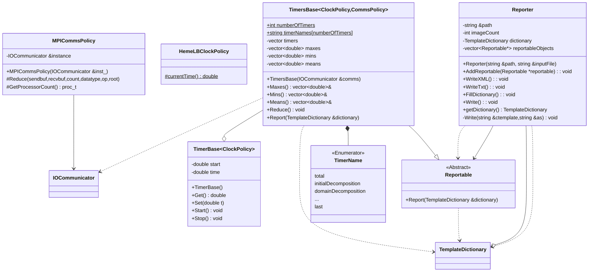

# HemePure-diagrams
Mermaid Diagrams for HemePure

## Reporting

```mermaid


classDiagram

%% --- src/reporting/Policies.h

class MPICommsPolicy {
    +MPICommsPolicy(IOCommunicator &inst_)
    #Reduce(sendbuf,recvbuf,count,datatype,op,root)
    #GetProcessorCount() proc_t
    -IOCommunicator &instance
}

MPICommsPolicy --> IOCommunicator


class HemeLBClockPolicy {
    #currentTime() double$
}

%% --- src/reporting/Timers.h

class TimerBase~ClockPolicy~{
    +TimerBase()
    +Get() double
    +Set(double t)
    +Start() void
    +Stop() void
    -double start
    -double time
}

class TimersBase~ClockPolicy,CommsPolicy~ {
   +int numberOfTimers$
   +string timerNames[numberOfTimers]$
   +TimersBase(IOCommunicator &comms)
   +Maxes() vector~double~&
   +Mins() vector~double~&
   +Means() vector~double~&
   +Reduce() void
   +Report(TemplateDictionary &dictionary)
   -vector<TimerBase~ClockPolicy~> timers
   -vector~double~ maxes
   -vector~double~ mins
   -vector~double~ means
}

TimersBase --|> Reportable
TimersBase ..> IOCommunicator
TimersBase ..> TemplateDictionary

TimersBase --o TimerBase

class TimerName {
    <<Enumerator>>
    total
    initialDecomposition
    domainDecomposition
    ...
    last
}

TimersBase *-- TimerName

%% --- ctemplate ---

class TemplateDictionary


%% --- src/reporting/Reportable.h ---

class Reportable {
    <<Abstract>>
    +Report(TemplateDictionary &dictionary)
}

Reportable ..> TemplateDictionary


%% --- src/reporting/Reporter.h ---

class Reporter {
    +Reporter(string &path, string &inputFile)
    +AddReportable(Reportable *reportable) : void
    +WriteXML() : void
    +WriteTxt() : void
    +FillDictionary() : void
    +Write() : void
    +getDictionary() TemplateDictionary
    -string &path
    -Write(string &ctemplate,string &as) void
    -int imageCount
    -TemplateDictionary dictionary
    -vector~Reportable*~ reportableObjects
}

Reporter --o TemplateDictionary
Reporter ..> TemplateDictionary

Reporter ..> Reportable
Reporter --> Reportable
```
