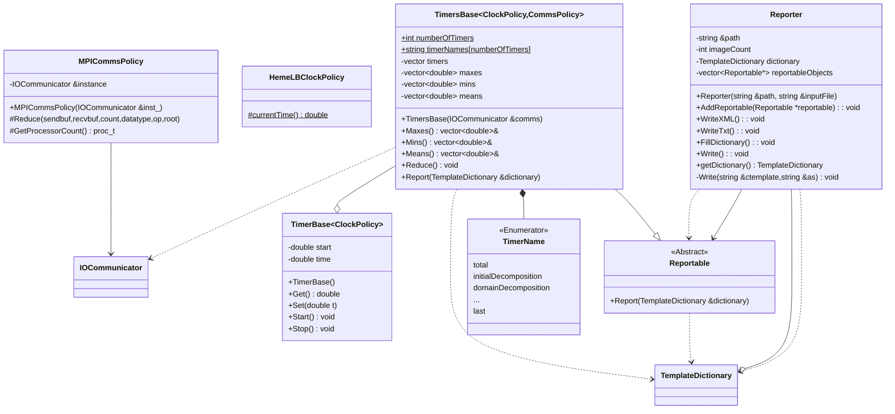

# HemePure-diagrams
Mermaid Diagrams for HemePure

## SimulationMaster 

```mermaid


classDiagram
direction BT

%% --- src/SimulationMaster.h

class SimulationMaster {
    +SimulationMaster(options,ioComms)
    +Abort() void
    +IsCurrentProcTheIOProc() bool
    +GetProcessorCount() int
    +RunSimulation() void
    +GetState() `SimulationState *`
    +Finalise() void
    +check_GPU_capabilities() void
    #DoTimeStep()* void

    -Initialise() void
    -SetupReporting() void
    -OutPutPeriod(unsigned int frequency) unsigned int
    -HandleActors() void
    -OnUnstableSimulation() void
    -WriteLocalImages() void
    -GenerateNetworkImages() void
    -RecalculatePropertyRequirements() void
    -LogStabilityReport() void

    #BoundaryValues *inletValues
    #BoundaryValues *outletValues
    #LatticeData *latticeData
    #LBM~latticeType~ latticeBoltzmannModel
    #NeighbouringDataManader *neighbouringDataManager
    #IOCommunicator &ioComms

    -SimConfig *simConfig
    -PathManager *fileManager
    -Timers timings
    -Reporter *reporter
    -BuildInfo build_info

    -SimulationState *simulationState
    -MonitoringConfig *monitoringConfig
    -StabilityTester~latticeType~ *stabilityTester
    -EntropyTester~latticeType~ *entropyTester

    -IncompressibilityChecker *incompressibilityChecker
    -ColloidController *colloidController
    -Net communicationNet

    -UnitConverter *unitConverter
    -IterableDataSource *propertyDataSource
    -PropertyActor *propertyExtractor

    -StepManager *stepManager
    -NetConcern *netConcern 

    -unsigned int imagesPerSimulation
    -unsigned int imagesPeriod
    -LatticeTimeStep FORCE_FLUSH_PERIOD$
}

SimulationMaster ..> CommandLine
SimulationMaster ..> IOCommunicator

SimulationMaster --> SimulationState
SimulationMaster --> BoundaryValues

SimulationMaster --> LatticeData

SimulationMaster --> LBM~LatticeType~
SimulationMaster --> NeighbouringDataManager

SimulationMaster --> SimConfig
SimulationMaster --> PathManager
SimulationMaster --> Timers
SimulationMaster --> Reporter
SimulationMaster --> BuildInfo

SimulationMaster --> MonitoringConfig
SimulationMaster --> StabilityTester~latticeType~
SimulationMaster --> EntropyTester~latticeType~
SimulationMaster --> IncompressibilityCheckerTester~latticeType~

SimulationMaster --> ColloidController
SimulationMaster --> Net

SimulationMaster --> UnitConverter

SimulationMaster --> IterableDataSource
SimulationMaster --> PropertyActor

SimulationMaster --> StepManager
SimulationMaster --> NetConcern
```

## Reporting

```mermaid


classDiagram

%% --- src/reporting/Policies.h

class MPICommsPolicy {
    +MPICommsPolicy(IOCommunicator &inst_)
    #Reduce(sendbuf,recvbuf,count,datatype,op,root)
    #GetProcessorCount() proc_t
    -IOCommunicator &instance
}

MPICommsPolicy --> IOCommunicator


class HemeLBClockPolicy {
    #currentTime() double$
}

%% --- src/reporting/Timers.h

class TimerBase~ClockPolicy~{
    +TimerBase()
    +Get() double
    +Set(double t)
    +Start() void
    +Stop() void
    -double start
    -double time
}

class TimersBase~ClockPolicy,CommsPolicy~ {
   +int numberOfTimers$
   +string timerNames[numberOfTimers]$
   +TimersBase(IOCommunicator &comms)
   +Maxes() vector~double~&
   +Mins() vector~double~&
   +Means() vector~double~&
   +Reduce() void
   +Report(TemplateDictionary &dictionary)
   -vector<TimerBase~ClockPolicy~> timers
   -vector~double~ maxes
   -vector~double~ mins
   -vector~double~ means
}

TimersBase --|> Reportable
TimersBase ..> IOCommunicator
TimersBase ..> TemplateDictionary

TimersBase --o TimerBase

class TimerName {
    <<Enumerator>>
    total
    initialDecomposition
    domainDecomposition
    ...
    last
}

TimersBase *-- TimerName

%% --- ctemplate ---

class TemplateDictionary


%% --- src/reporting/Reportable.h ---

class Reportable {
    <<Abstract>>
    +Report(TemplateDictionary &dictionary)
}

Reportable ..> TemplateDictionary


%% --- src/reporting/Reporter.h ---

class Reporter {
    +Reporter(string &path, string &inputFile)
    +AddReportable(Reportable *reportable) : void
    +WriteXML() : void
    +WriteTxt() : void
    +FillDictionary() : void
    +Write() : void
    +getDictionary() TemplateDictionary
    -string &path
    -Write(string &ctemplate,string &as) void
    -int imageCount
    -TemplateDictionary dictionary
    -vector~Reportable*~ reportableObjects
}

Reporter --o TemplateDictionary
Reporter ..> TemplateDictionary

Reporter ..> Reportable
Reporter --> Reportable
```

## Configuration and IO

```mermaid

classDiagram
direction BT

%% --- src/configuration/CommandLine.h

class CommandLine {
    +CommandLine(argc,argv)
    +GetUsage() string$
    +NumberOfImages() unsigned int
    +GetOutputDir() string &
    +GetInputFileU() string &
    +ArgumentCount() int
    +Arguments() : `char**`
    -string inputFile
    -string outputDir
    -unsigned int images
    -int argc
    -char** argv
}

class OptionError
class Exception

OptionError --|> Exception
OptionError --* CommandLine

%% --- src/configuration/SimConfig.h

class SimConfig {
    
    +New(string &path) : SimConfig*$
    #SimConfig(string path)
    #Init() void
    +Save(string path)
    +GetInlets()
    +GetOutlets()
    +GetStressType()
    +GetMaxmimumVelocity()
    +GetMaximumStress()
    +GetDataFilePath()
    +GetTotalTimeSteps()
    +GetWarmUpSteps()
    +GetTimeStepLength()
    +GetVoxelSize()
    +GetGeometryOrigin()
    +PropertyOutputCount()
    +GetPropertyOutput()
    +GetPropertyOutputs()
    +GetColloidConfigPath()
    +HasColloidSection()
    +GetInitialPressure()
    +GetUnitConverter()
    +GetMonitoringConfiguration()
    #CreateUnitConverter()$ void
    #CheckIoletMatchesCMake(ioletEl, requiredBC)$ void
    #GetDimensionalValueInLatticeUnits(elem,units,value)
    #GetDimensionalValueInLatticeUnits(elem,units)
    -DoIO()
    -DoIOForSimulation()
    -DoIOForGeometry()
    -DoIOForInOutlets()
    -DoIOForBaseInOutlet()
    -DoIOForPressureInOutlet()
    -DoIOForCosinePressureInOutlet()
    -DoIOForFilePressureInOutlet()
    -DoIOForVelocityInOutlet()
    -DoIOForParabolicVelocityInOutlet() 
}


%% --- src/io/PathManager.h

class PathManager {
    +PathManager(CommandLine commandLine, bool &io, int &processorCount)
    +GetInputFile() string &
    +GetImageDirectory() string &
    +GetColloidPath() string &
    +GetReportPath() string &
    +SaveConfiguration(SimConfig *simConfig) void
    +EmptyOutputDirectories() void
    +XdrImageWriter(long int time) Writer
    +GetDataExtractionPath() string &
    -GuessOutputDir() void
    -string outputDir
    -string inputFile
    -string imageDirectory
    -string colloidFile
    -string configLeafName
    -string reportName
    -string dataPath
    -CommandLine &options
    -bool doIo
}

PathManager ..> Writer
PathManager --> CommandLine
PathManager --o CommandLine

PathManager ..> SimConfig

%% --- src/io/formats/geometry.h

class geometry {
    <<Singleton>>
    +Get() geometry &$
    +GetMaxBlockRecordLength(blockSideLength) unsigned int 
    +GetMaxBlockRecordLength(blockSideLength,nFluidSites) unsigned int
    +GetNeighbourhood()$ vector~Vector3D~int~~ &
    -geometry()
    -geometry *singleton$
    -vector~Vector3D~int~~ displacements
}

%% --- src/io/writers/Writer.h

class Writer {
    <<Abstract>>
    +getCurrentStreamPosition()* unsigned int
    +operator<<(value) Writer &
    #Writer()
    #writeFieldSeparator()* void
    #writeRecordSeparator()*
    #_write()*
}

%% --- src/io/writers/null/NullWriter.h

class NullWriter

NullWriter --|> Writer

%% --- src/io/writers/ascii/AsciiStreamWriter.h

class AsciiStreamWriter

AsciiStreamWriter --|> Writer


%% --- src/io/writers/ascii/AsciiFileWriter.h

class AsciiFileWriter {
    +AsciiFileWriter(string fileName)
}

AsciiFileWriter --|> AsciiStreamWriter


%% --- src/io/writers/xdr/XdrMemWriter.h

class XdrWriter {
    +getCurrentStreamPosition() unsigned int
    +writeFieldSeparator() void
    +writeRecordSeparator() void
    #_write()
    #XDR mXdr
}

XdrWriter --|> Writer
XdrWriter --o XDR

%% --- src/io/writers/xdr/XdrMemWriter.h


class XdrMemWriter {
    +XdrMemWriter(char *dataBuffer, unsigned int dataLength)
}

XdrMemWriter --|> XdrWriter

%% --- src/io/writers/xdr/XdrFileWriter.h

class XdrFileWriter {
    +XdrFileWriter(string &fileName, string &mode)
    -FILE *myFile
}

XdrFileWriter --|> XdrWriter

%% --- src/io/writers/xdr/XdrReader.h

class XdrReader {
    #XdrReader()
    #XDR mXdr
    -FILE *myFile
    +readDouble(double &outDouble) bool
    +readFloat(float &outDouble) bool
    +readInt(int &outInt) bool
    +readUnsingedInt(unsigned int &outUint)
    +readUnsignedLong(uint64_t &outUlong)
    +GetPosition() unsigned int
    +SetPosition(unsigned int iPosition) bool
}

XdrReader --o XDR

%% --- src/io/writers/xdr/XdrMemReader.h

class XdrMemReader {
    +XdrMemReader(dataBuffer, dataLength)
}

XdrMemReader --|> XdrReader

%% --- src/io/writers/xdr/XdrFileReader.h

class XdrFileReader {
    +XdrFileReader(xdrFile)
}

XdrFileReader --|> XdrReader
```
